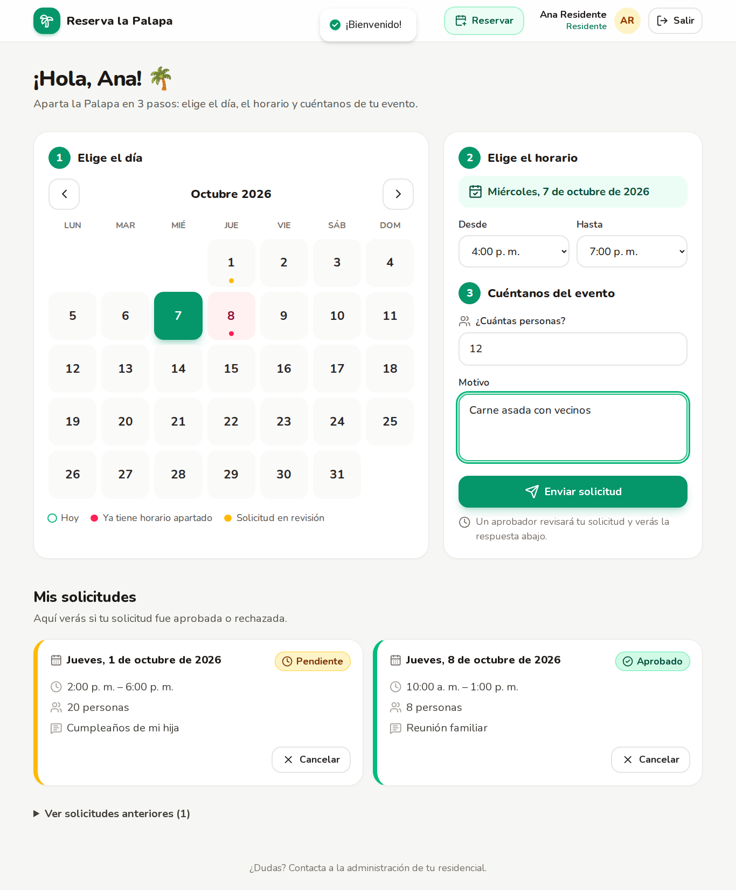
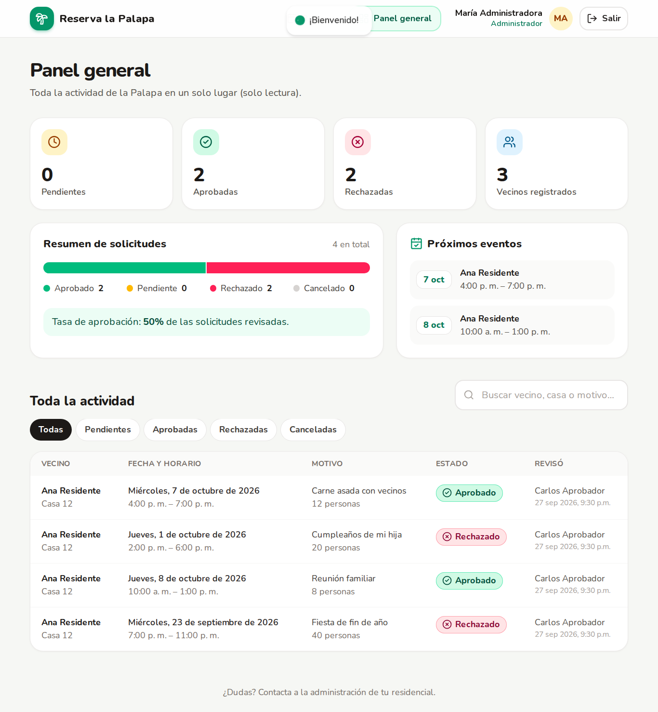

# 🌴 Reserva la Palapa

Sistema de reservaciones para el área común (Palapa) de un residencial.
Residential booking app for a community gazebo. **UI is 100% Spanish**; code is in English.

| Rol | Qué puede hacer | Página |
| --- | --- | --- |
| **Residente** | Registrarse, ver el calendario de disponibilidad, solicitar y cancelar | `/dashboard` |
| **Aprobador** | Ver solicitudes pendientes (se actualizan solas), aprobar o rechazar con motivo | `/dashboard/aprobador` |
| **Administrador** | Panel de solo lectura con métricas, próximos eventos, filtros y búsqueda | `/dashboard/admin` |

> Every role can also make its own reservation from `/dashboard`.

## Stack
Next.js 16 (App Router, Server Actions) · Tailwind CSS v4 · Prisma 6 + SQLite · NextAuth v4 (Credentials) · lucide-react · react-hot-toast · zod

## Quick start (Codespaces or local)

```bash
cp .env.example .env        # then set NEXTAUTH_SECRET (openssl rand -base64 32)
npm install                 # also runs `prisma generate`
npm run db:migrate          # creates prisma/dev.db and seeds it
npm run dev                 # http://localhost:3000
```

In **GitHub Codespaces**, the included `.devcontainer` runs all of this for you. Then just `npm run dev`.
Set `NEXTAUTH_URL` to the forwarded URL of port 3000 if the logout or login redirects misbehave.

### Demo accounts (password `Palapa123`)

| Rol | Correo |
| --- | --- |
| Residente | `residente@palapa.com` |
| Aprobador | `aprobador@palapa.com` |
| Administrador | `admin@palapa.com` |

To make an existing user an approver or admin, run `npm run db:studio` and change their `role`.

### Useful scripts
| Script | Description |
| --- | --- |
| `npm run db:migrate` | Apply schema changes (`prisma migrate dev`) |
| `npm run db:seed` | Re-create demo users and sample reservations |
| `npm run db:reset` | Wipe the DB, re-migrate and re-seed |
| `npm run db:studio` | Visual DB editor |

## Business rules (edit in `src/lib/constants.ts`)
- Hours: 08:00 – 22:00 in 30-minute steps. Timezone `America/Mexico_City`.
- Bookings allowed up to 90 days ahead; no past dates; max 60 guests.
- A time slot that overlaps an **approved** booking cannot be requested or approved.
- Approvers see a warning when two pending requests collide.
- A rejection **requires** a reason, and the resident sees it.
- Residents can cancel their own pending/approved future bookings.

## Project structure
```
prisma/            schema.prisma, migrations, seed.ts
src/app/actions/   Server Actions (register, create/cancel/review reservation)
src/app/login      /login           src/app/register  /register
src/app/dashboard  layout (auth guard + nav), resident page
  aprobador/       approver dashboard      admin/  admin analytics
src/components/    AppNav, StatusBadge, AuthShell, AutoRefresh, …
src/lib/           prisma, auth (NextAuth options), session guards, formatting
```

## Hero image
The login page shows `public/images/palapa.jpg` if it exists (e.g. an image generated with Picsart) and a green gradient otherwise.





