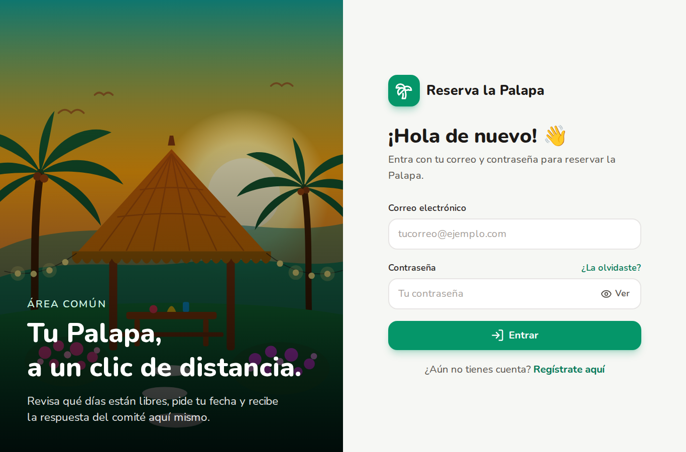
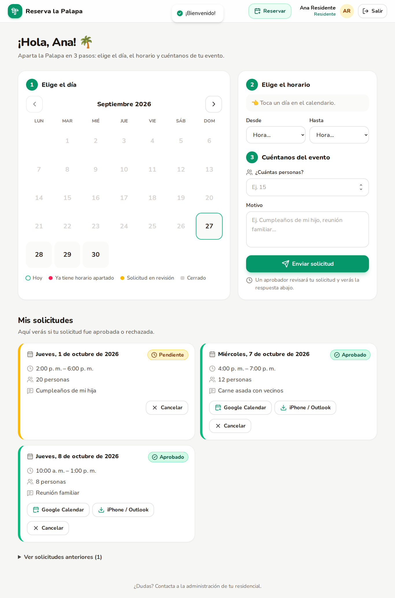
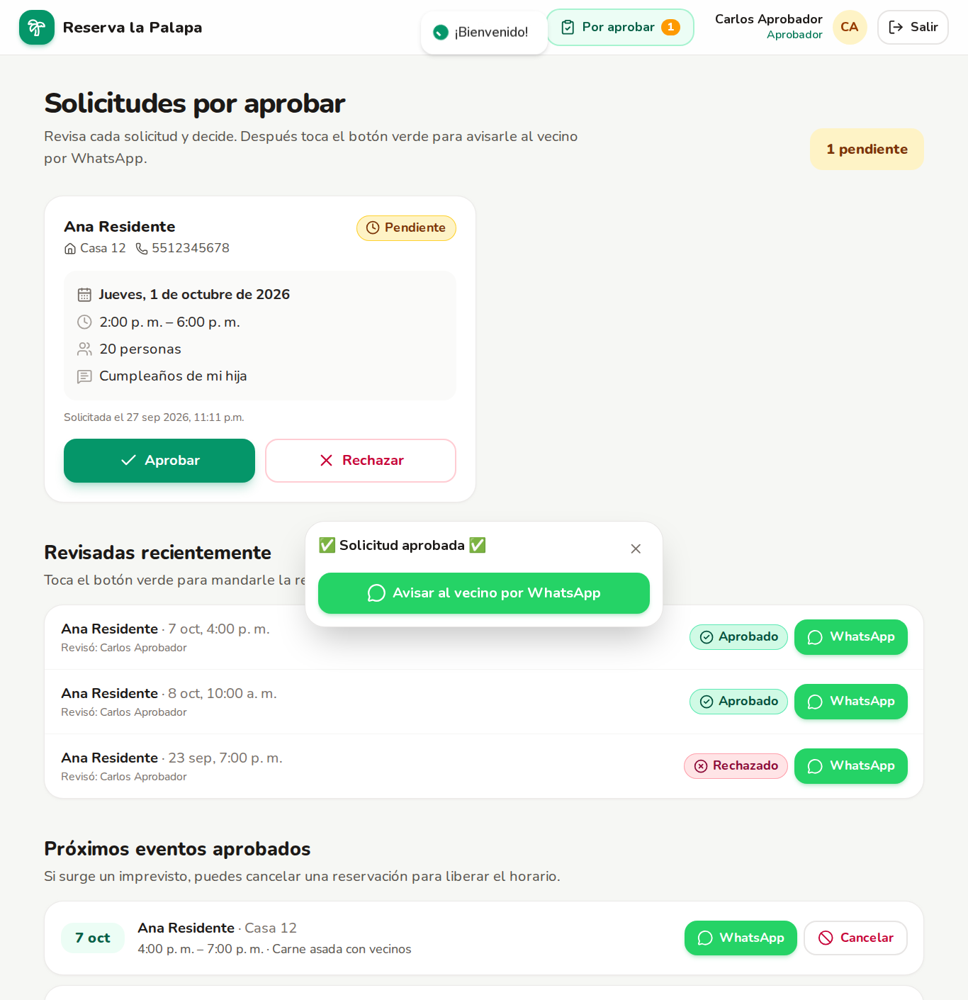
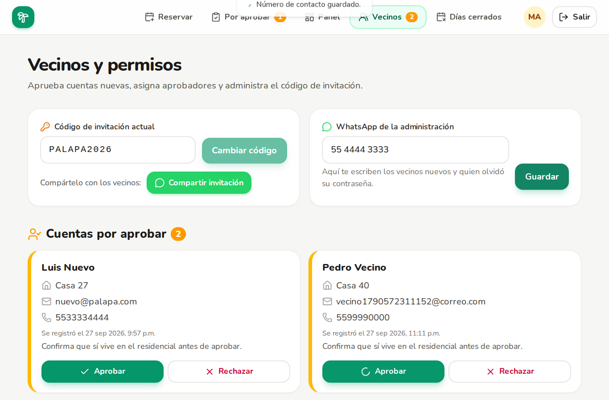

# 🌴 Reserva la Palapa

Sistema de reservaciones para el área común (Palapa) de un residencial.
Residential booking app for a community gazebo. **UI is 100% Spanish**; code is in English.

| Rol | Qué puede hacer |
| --- | --- |
| **Residente** | Registrarse con código de invitación, ver el calendario, solicitar, cancelar (libera el horario), agregar a su calendario |
| **Aprobador** | Aprobar / rechazar, cancelar reservaciones aprobadas, avisar por WhatsApp |
| **Administrador** | Todo lo del aprobador + aprobar cuentas nuevas, asignar roles, cambiar el código de invitación, bloquear días, panel con métricas y descarga en Excel |

Everyone can also book the Palapa for themselves from **Reservar**.

## Features
- **Invite code + account approval**: new sign-ups need the neighborhood code, then an admin approves them.
- **Availability calendar**: red = booked, yellow = under review, striped grey = closed day (with the reason shown).
- **Notices by WhatsApp (free, no email needed)**: after each action a green button opens WhatsApp with the message already written; the person just taps send (`wa.me` links, no API or cost):
  new account → administration · account approved → neighbor · new request → committee · approved / rejected / cancelled → neighbor.
- **Add to calendar**: Google Calendar link and `.ics` download (iPhone / Outlook) on approved bookings.
- **Forgot password**: the neighbor asks the administration by WhatsApp; the admin taps **Contraseña** in *Vecinos* and sends a single-use, 24-hour link (only a hash is stored).
- **Blocked days**: the admin closes dates; nobody can request or approve them.
- **Excel export** (admin only): reservations, residents and closed days in one `.xlsx`.
- **Installable app (PWA)**: “Instalar” prompt on Android/desktop, instructions on iPhone, offline page.
- Role changes and deactivated accounts take effect immediately (checked on every request).

## Stack
Next.js 16 (App Router, Server Actions) · Tailwind CSS v4 · Prisma 6 + libSQL adapter (SQLite locally, **Turso** in production) · NextAuth v4 · ExcelJS · lucide-react · react-hot-toast · zod

## Local development (Codespaces or your computer)

```bash
cp .env.example .env     # set NEXTAUTH_SECRET; leave TURSO_* empty
npm install
npm run db:migrate       # creates prisma/dev.db and seeds demo data
npm run dev              # http://localhost:3000
```
In **GitHub Codespaces** the `.devcontainer` does all of this automatically.

### Demo accounts (password `Palapa123`, invite code `PALAPA2026`)
| Rol | Correo |
| --- | --- |
| Residente | `residente@palapa.com` |
| Aprobador | `aprobador@palapa.com` |
| Administrador | `admin@palapa.com` |
| Cuenta por aprobar | `nuevo@palapa.com` |

## Deploying: Vercel + Turso

1. **Turso** (database, free tier)
   ```bash
   # install the CLI: https://docs.turso.tech/cli/installation
   turso auth signup
   turso db create palapa
   turso db show palapa --url                 # -> TURSO_DATABASE_URL
   turso db tokens create palapa              # -> TURSO_AUTH_TOKEN
   ```
   Put both values in your `.env`, then create the tables and your admin account (the phone is optional):
   ```bash
   npm run turso:migrate
   npm run create-admin -- tu@correo.com "Tu Nombre" "UnaContraseñaSegura" 5512345678
   ```
   While those two lines are in `.env`, `npm run dev` also uses Turso. Empty them again to go back to the local file.
   Run `turso:migrate` again whenever a new folder appears in `prisma/migrations`.

2. **Vercel** (hosting, free Hobby plan)
   - *Add New → Project* → import this GitHub repo (framework: Next.js, defaults are fine).
   - Environment variables (only three): `TURSO_DATABASE_URL`, `TURSO_AUTH_TOKEN`, `NEXTAUTH_SECRET`.
   - Deploy. Your address is shown on the project's **Overview** under *Domains*.

3. **First steps in the app**: log in with your admin, go to **Vecinos**, save the administration's WhatsApp number, change the invite code and share it with *Compartir invitación*.

## Scripts
| Script | Description |
| --- | --- |
| `npm run dev` / `build` / `start` | Next.js |
| `npm run db:migrate` | Create a migration from `schema.prisma` changes (local) |
| `npm run db:seed` | Re-create demo users and sample data (local) |
| `npm run db:studio` | Visual editor for the local DB |
| `npm run turso:migrate` | Apply pending migrations to Turso |
| `npm run create-admin -- email "Name" "password"` | Create/promote an admin (local or Turso) |

## Business rules (`src/lib/constants.ts`)
- Hours 08:00 – 22:00 in 30-minute steps, timezone `America/Mexico_City`.
- Up to 90 days ahead, no past dates, max 60 guests.
- No overlaps with approved bookings or closed days, both when requesting and approving.
- Rejections and staff cancellations require a reason, which the neighbor sees.

## Project structure
```
prisma/                schema, migrations, seed
scripts/               turso-migrate.ts, create-admin.ts
src/app/actions/       Server Actions: auth.ts, reservations.ts, admin.ts
src/app/api/           NextAuth, .ics download, Excel export
src/app/dashboard/     resident page · aprobador/ · admin/ (panel, usuarios/, fechas/)
src/app/login|register|recuperar|restablecer
src/lib/               prisma, auth, session guards, settings, whatsapp messages, calendar, format
public/                icons, manifest assets, sw.js, offline.html, images/palapa.svg
```





